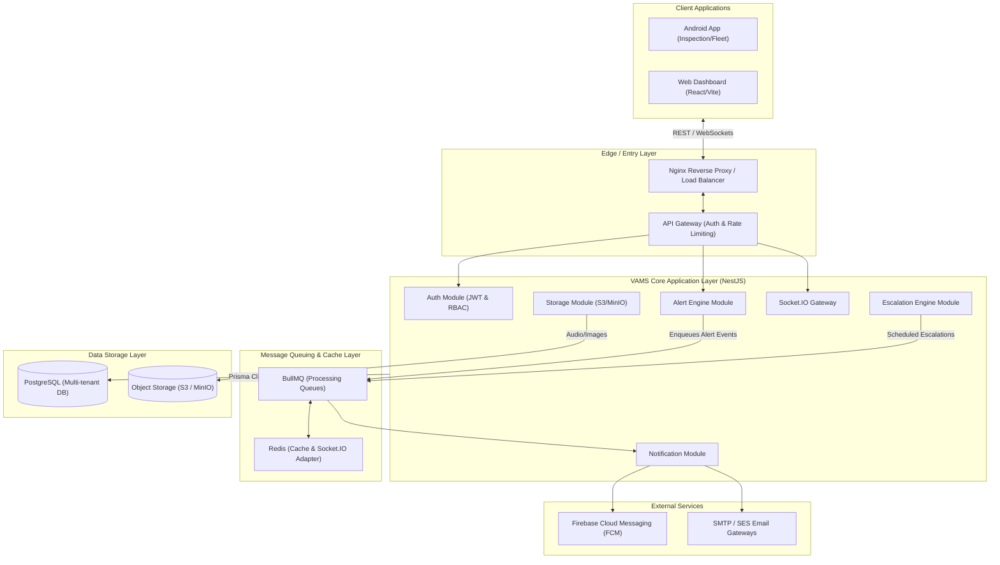
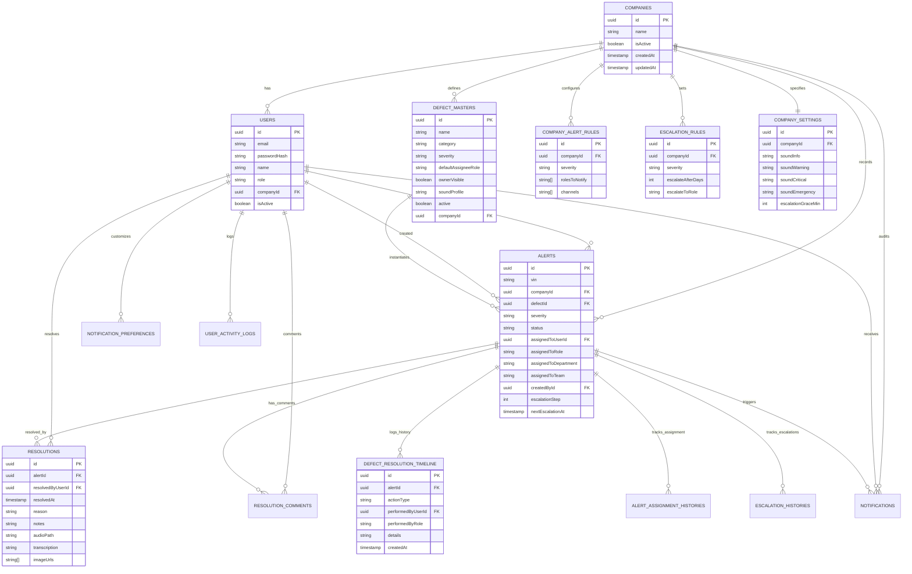
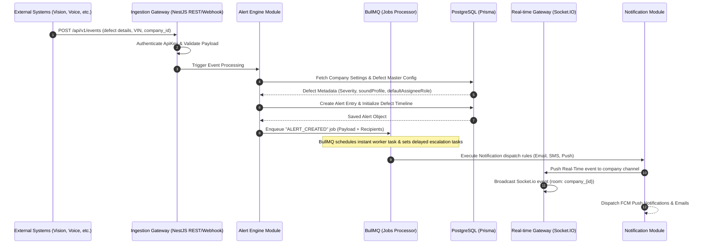

# Vehicle Alert Management System (VAMS) - System Architecture & Design

This document details the high-level architecture, design specifications, and implementation topologies for the multi-tenant Vehicle Alert Management System (VAMS). It covers the design patterns, databases, message routing, escalation policies, security layers, and enterprise scale strategies.

---

## 1. Logical System Architecture

VAMS adopts an event-driven microservices architecture to process inputs from external applications (Voice/Vision inspection, Manufacturing, Fleet, etc.) and deliver real-time, low-latency updates and notifications.

### High-Level Architecture Diagram


---

## 2. Multi-Tenant Database ER Diagram

To guarantee data isolation while achieving resource efficiency, VAMS implements **application-level schema sharing with Logical Tenant Isolation** via `company_id`. Every query must target a company index to prevent cross-company leakage.



---

## 3. Centralized Alert Engine Design

All external systems integrate through a central ingestion webhook/REST layer. The Alert Engine coordinates priority mapping, notifications, assignment, and escalation configurations.

### 3.1 Event Lifecycle Sequence Diagram


---

## 4. Escalation Engine Architecture

Escalations must occur automatically without relying on user action. The system uses a scheduler mechanism to compute SLA times and process overdue assignments.

### 4.1 Chronological Workflow and SLAs
Every time an alert is created or reassigned, the `nextEscalationAt` timestamp is updated based on `EscalationRules` defined in the database for the company.
* **BullMQ Scheduler**: Runs a recurring cron job every minute.
* **Query Optimization**: Finds all `Alerts` where `status != RESOLVED` and `nextEscalationAt <= NOW()`.
* **Escalation Step Execution**:
  1. Determine next escalation tier (e.g. Day 0 -> Worker, Day 3 -> Supervisor, Day 7 -> Manager).
  2. Write to `EscalationHistory` and `DefectResolutionTimeline`.
  3. Reassign `assignedToRole` to the escalated role.
  4. Recalculate next escalation timestamp.
  5. Publish real-time events to supervisors/managers.
  6. Enqueue notifications (SMS, Emails, and Priority Push).

---

## 5. Notification & Real-Time Sync Structure

To avoid blocking request-response threads, all notifications are processed out-of-band by **BullMQ** using **Redis** backend.

### 5.1 Real-Time Sync Flow
1. **WebSockets Channels (Socket.IO)**:
   - Client authenticates with JWT and joins a specific room matching their company: `company_{companyId}`.
   - Separate supervisor and admin roles join additional sub-rooms: `company_{companyId}_management` to receive escalation alerts.
2. **Redis Adapter**:
   - Multiple NestJS backend instances coordinate websocket events using the Redis Pub/Sub adapter. This allows the system to scale horizontally behind a load balancer.

### 5.2 Sound Profile Distribution
To ensure Google Play Compliance and provide immediate visual/audio urgency:
* High/Critical/Emergency alerts deliver a specific payload metadata field: `sound_profile` (e.g., `siren`, `alarm`).
* The Android client reads this metadata and routes the notification to a pre-defined **Android Notification Channel** mapped to that sound.
* Under Google Play regulations, users must be allowed to configure these channels individually within the Android settings panel (mute, vibrate, choose sound).

---

## 6. Security and Tenant Isolation Design

### 6.1 Logical Data Isolation
- **Tenant Context Interceptor**: A NestJS Interceptor extracts the `companyId` from the JWT token and binds it to the request context (`Request.user.companyId`).
- **Prisma Middlewares / Custom Repository**: All queries implicitly inject the `companyId` constraint. E.g.:
  ```typescript
  prisma.alert.findMany({ where: { companyId: req.user.companyId } });
  ```
- **Primary Database Indices**: Tables including `Alert`, `User`, `DefectMaster`, `Notification` have a composite index starting with `companyId` to optimize read performance and enforce isolation.

### 6.2 Role-Based Access Control (RBAC)
Custom Decorators `@Roles(...)` verify user access levels.
* **Super Admin**: Full platform access (Manage companies, overall telemetry).
* **Company Admin**: Company-wide rules, settings, sound config, user onboarding.
* **Factory Manager / Supervisor**: Reassignment, resolving, adding notes, viewing reports.
* **Worker**: Reviewing assigned defects, adding audio comments, resolving own alerts.

---

## 7. Production Scaling and Deployment Strategy

### 7.1 Database Scaling (PostgreSQL)
* **Read-Write Splitting**: Route queries to Read Replicas (for dashboards and timelines) and write transactions to the Primary Master.
* **Table Partitioning**: Partition the `alerts`, `defect_resolution_timeline`, and `notifications` tables by `companyId` or by date ranges (e.g., monthly partitions) to ensure indexes remain in RAM.

### 7.2 Cache Strategy (Redis)
* Cache static elements: `DefectMaster` and `CompanySettings` definitions are cached with a TTL.
* When configurations are updated by the Company Admin, the cache key is invalidated.

### 7.3 Infrastructure Topology (Docker & Kubernetes)
* Deploy backend pods in a Kubernetes cluster using HPA (Horizontal Pod Autoscaler) targeting CPU/Memory usage.
* Separate pod pools:
  - **HTTP API Pods**: Serving REST webhooks and dashboard clients.
  - **WebSocket Gateway Pods**: High connection limits, sticky sessions enabled.
  - **Queue Worker Pods**: Running BullMQ consumer loops without exposing ports.
